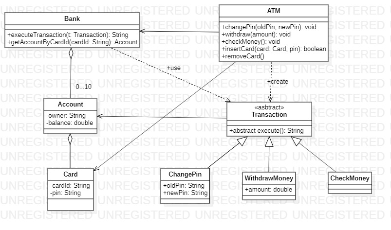

# Implement the following exercises

In this lab you will create small Java applications by using as reference an UML class diagram. Please consider following general notes before start implementing:
- toString() method when required will return a string like *ClassName{attributeName1=attributeValue1,...,attributeNamen=attributeValuen}*.
- Do not reuse (import) the same class in multiple exercises. **Each exercise is standalone and should be resolved in its package.**

## Exercise 1


Given the UML class diagram above, implement the corresponding Java program.

1. Create Java class based on the diagram above. 
2. Demonstrate the functionality of application in Exercise1 class main method.
3. Create minimal unit tests for testing the behavior of the programm.

**Note 1: Constructors and setter\getter methods are not represented in the diagram bu can\should be implemented."**

**Note 2: You can add any suplimentary methods if required.**


## Exercise 2

Create an UML Use-Case diagram describing an ATM system. Save jpg use case diagram in /docs subfolder and display it in this readme file bellow.

**>>>>insert use case diagram here<<<<**

## Exercise 3

```java
interface Playable {
    void play();
}

class ColorVideo implements Playable {

    private String fileName;

    public ColorVideo(String fileName){
        this.fileName = fileName;
        loadFromDisk(fileName);
    }

    @Override
    public void play() {
        System.out.println("Play " + fileName);
    }

    private void loadFromDisk(String fileName){
        System.out.println("Loading video..." + fileName);
    }
}

class ProxyVideo implements Playable {

    private ColorVideo video;
    private String fileName;

    public ProxyVideo(String fileName){
        this.fileName = fileName;
    }

    @Override
    public void play() {
        if(video == null){
            video = new ColorVideo(fileName);
        }
        video.play();
    }
}
```

For the application above:
* create UML class diagram and display it bellow.
* add a new class _BlakAndWhiteVideo_ which will displaye message "Play black and white video {name of the video}".
* add necessary changes in ProxyVide class so that depending on a constructor argument given in this class the proxy to call either black and white or color playable video.

**>>>>insert class diagram here<<<<**